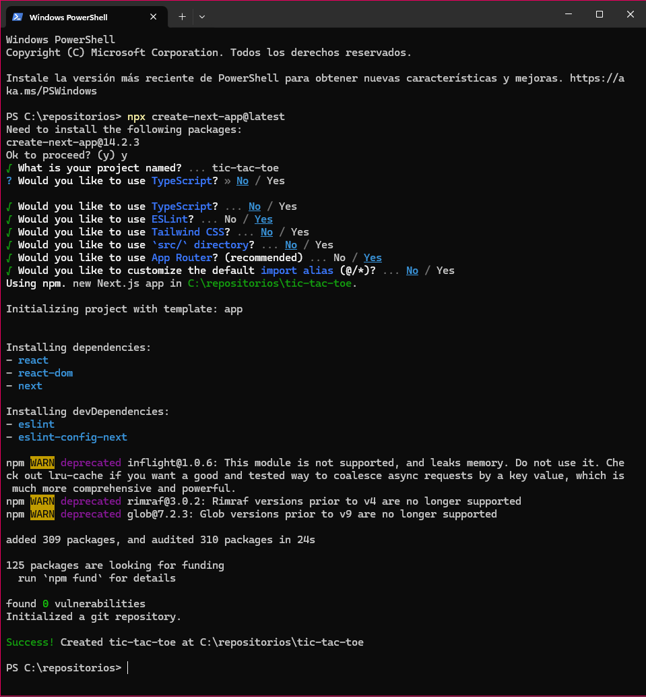
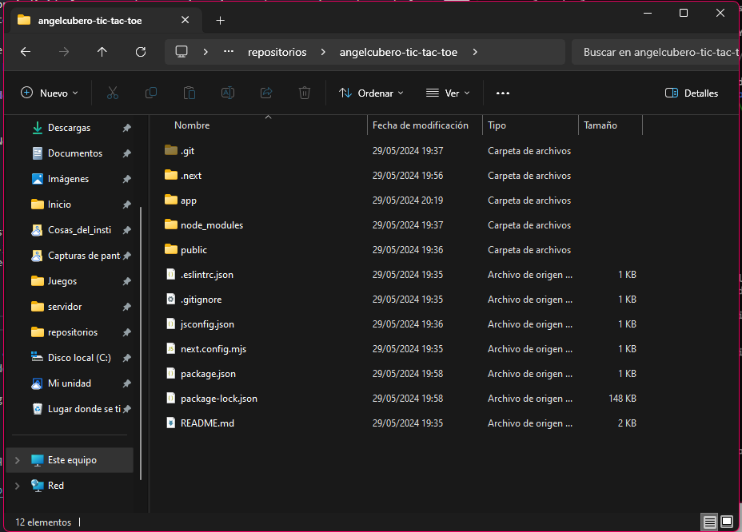
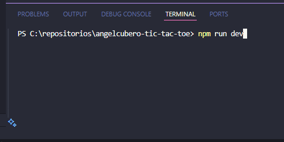
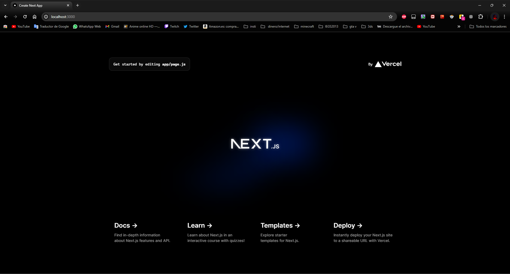
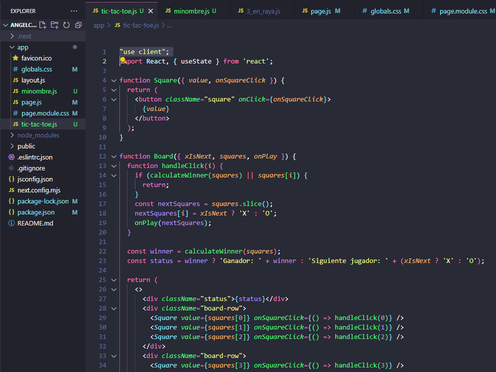
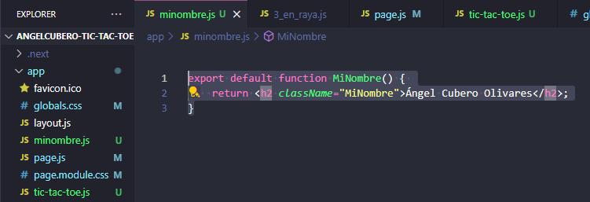
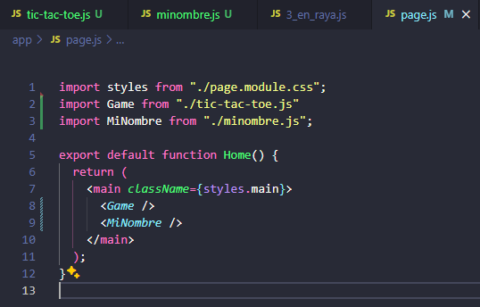
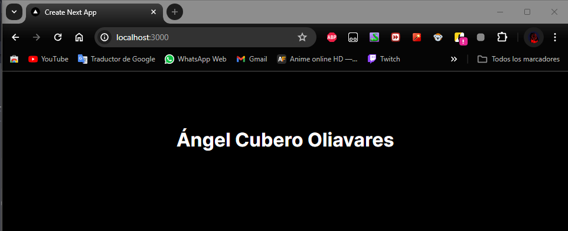
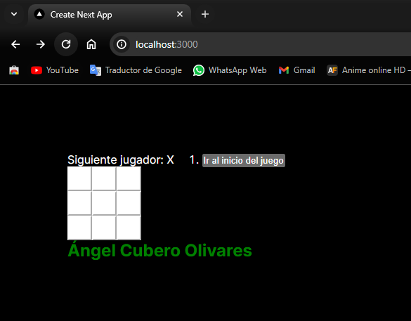
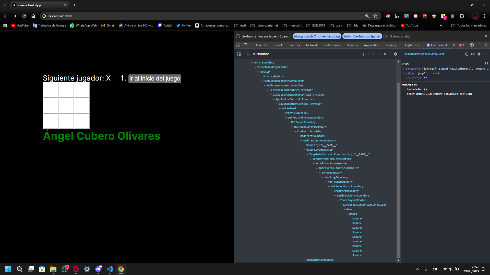

[](https://classroom.github.com/a/NJk24H-V)
# TIC TAC TOE en local con Next.js


## Cómo trabajar con REACT en local 

Hasta ahora hemos trabajado en React de forma interactiva desde CodeSandBox (similar a Stackblitz, o CodePen), editor de texto online que permite trabajar con React. CodeSandBox es un editor de texto basado en el navegador que acelera y mejora el desarrollo web para desarrolladores mediante la automatización, la transpiración, el empaquetado y la gestión de dependencias. 


Pero ahora deseamos crear una nueva aplicación o un nuevo sitio web completamente con React. Para ello, la página oficial de React recomienta que se elija uno de los frameworks hechos con React. Los frameworks brindan funcionalidades que la mayoría de las aplicaciones y los sitios eventualmente necesitan, incluido el enrutamiento, la obtención de datos y la generación de HTML.

Previamente necesitarás instalar Node.js para el desarrollo local. 

## Next.js de Vercel
Next.js es un framework de React para crear aplicaciones web full-stack. Utilice React Components para crear interfaces de usuario y Next.js para funcionalidades y optimizaciones adicionales.

Internamente Next.js también abstrae y configura automáticamente las herramientas necesarias para React, como agrupación (bundling), compilación y otras. Esto le permite concentrarse en crear su aplicación en lugar de dedicar tiempo a la configuración.

Ya sea que sea un desarrollador individual o parte de un equipo más grande, Next.js puede ayudarlo a crear aplicaciones React interactivas, dinámicas y rápidas.

React menciona a Next.js entre sus herramientas recomendadas, indicando que es una solución para crear sitios web renderizados por el servidor.

## Iniciar un nuevo proyecto de React


Para crear un nuevo proyecto Next.js, ejecuta en tu terminal:

```shell
npx create-next-app@latest
```

El mantenimiento de Next.js está a cargo de Vercel. Puedes implementar una aplicación Next.js en cualquier alojamiento de Node.js, serverless, o en tu propio servidor. Next.js también admite una exportación estática que no requiere un servidor.





Durante la creación se indica el nombre del nuevo proyecto y se aceptan los valores por defecto. Se creará un proyecto partiendo de una plantilla app, y se instalan las dependencias necesarias.

Se inicializa un repositorio git y ya se puede abrir el nuevo proyecto en el editor Visual Studio Code.


Puedes abrir el `README.md`, que indica que para comenzar debes abrir la terminal...


E iniciar el servidor de desarrollo mediante el comando...

```bash
npm run dev
```



Ya puedes visualizar el resultado abriendo http://localhost:3000





## Tarea

Debes dejar operativo el juego TIC-TAC-TOE en local partiendo de un proyecto de NEXT.JS.
- El proyecto debe llevar tu nombre: `minombre-tic-tac-toe`
- Documenta el proceso. Cambia TODOS los pantallazos anteriores por los tuyos: debe verse tu nombre en el proyecto

    Para hacer funcionar el proyecto de tic-tac-toe en local hay que crear un fichero js con los componentes (tic-tac-toe.js) y otro con el componente que mostrará mi nombre (MiNombre.js):

    Para que el fichero con el juego funcione he tenido que añadir lo que se aprecia en la primera linea en la captura
    
    

    Por ultimo hay que cambiar el contenido del fichero page.js y dejarlo así:
    


- En `page.js` muestra tu nombre y apellidos. Entrega aquí el pantallazo del navegador.

- Ya que tienes localizado el archivo principal donde debes visualizar el juego TIC-TAC-TOE. Ahora añádelo a tu nuevo proyecto, indicando las modificaciones que has hecho.
- Añade debajo del tablero un componente `MiNombre` que muestre tu nombre y apellido en color verde. Debe estar en un fichero aparte y exportado con `export default`. Añade aquí el código
```jsx
export default function MiNombre() { 
    return <h2 className="MiNombre">Ángel Cubero Olivares</h2>;
}
```
y su uso en `page.js`...
```jsx
return (
    <main className={styles.main}>
      <Game />
      <MiNombre />
    </main>
  );
```
- Muestra aquí un pantallazo que lo demuestre (localhost y tu nombre en el propio juego).


- Muestra pantallazo de React DevTools 


- Sube y enlaza los ficheros modificados/creados
  - [page.js](./ficheros_proyecto/page.js)
  - [tic-tac-toe.js](./ficheros_proyecto/tic-tac-toe.js)
  - [minombre.js](./ficheros_proyecto/minombre.js)
  - [globals.css](./ficheros_proyecto/globals.css)
  - [page.module.css](./ficheros_proyecto/page.module.css)
    
- Enseña a la profesora el proyecto operativo en el navegador

## De interés: 

- https://youtu.be/h1WLN9Gzbwc (2:45)
- https://nextjs.org/docs/pages/api-reference/create-next-app 
  
- https://es.react.dev/learn/start-a-new-react-project#nextjs

- https://es.react.dev/learn/add-react-to-an-existing-project 

- https://emapeire.medium.com/c%C3%B3mo-funciona-next-js-9b56ec3ecced

- https://es.react.dev/learn/start-a-new-react-project https://nextjs.org/docs/app/building-your-application/routing
- https://react.dev/learn/react-developer-tools
